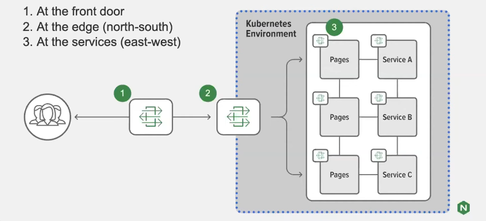

# API Gateway
This document serves to provide some context to the meaning of an API gateway within the context of the ICAP architecture. 

## Definition
An API gateway facilitates the routing of requests from a client to the appropriate service. But a big misunderstanding among developers that are just starting to learn about this topic, is that an API gateway is a single piece of technology. Rather, an “API gateway” describes a set of use cases that can be implemented via different types of proxies. This includes, but is not limited to, an application delivery controller (ADE), load balancer, reverse proxy, ingress controller or service mesh. 

There also is no industry-wide standard for what features an API gateway needs in order to be defined as such. In most cases though, the use of an API gateway stems from business requirements that define a need for securing and routing of requests in a distributed architecture. 

## Use-case within ICAP
The need for an API gateway within ICAP stems from the need to route requests dynamically, without the client having to know about each individual service. An additional use-case that stems from the risk analysis is the need to make accessing the microservices inherently more secure. Making it so individual services do not have to be exposed to the entirety of the world wide web and in turn, having the requests be routed through a single entrypoint makes the application more secure.

## Implementation
As mentioned in the definition, there are several different technologies that are suitable to serve as an API gateway. Within ICAP, individual microservices are containerized using Docker and then made available as part of a cluster through the use of Kubernetes as the container orchestration tool. 

After doing some research online, there are mainly 3 possible places where you can put your API gateway, as illustrated by the image below. The placement of the gateway also does not have to be limited to just a single place. It can be a combination of places.

In the case of ICAP it makes sense to place the gateway at the edge of the cluster as there will only be a single Kubernetes cluster within ICAP. The technology choice for the API gateway will be to make use of a Kubernetes natively availabel ingress controller that can both route requests, but also authorize those requests. 

In order to achieve a secure request format, ICAP will make use of JSON Web Tokens (JWTs for short or "JOTs" in spoken language). These JWTs will be validated by the ingress controller and then the request will be processed by the appropriate service. At the service level the token can then be used to allow the request to be processed or not by checking the token against the one given by the identity provider. 