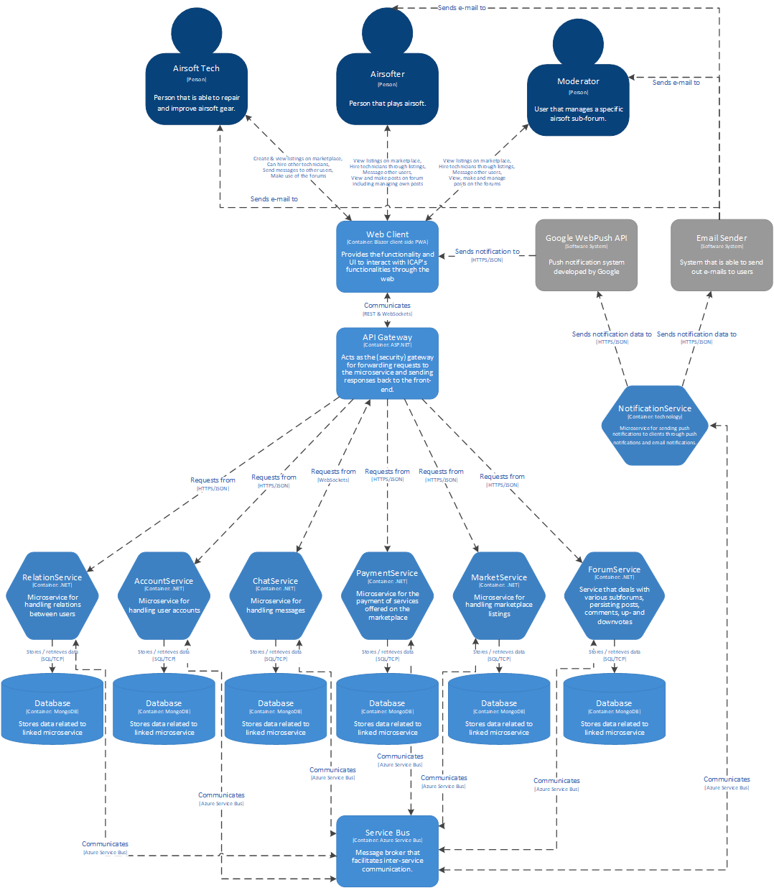

# C4 Models for ICAP
This document serves to give context to the C1 and C2 diagrams I've made for ICAP.

## C1 - System Context Diagram

As can be seen above, ICAP has three different user roles that can interact with it. The main user (Airsofter) is able to view the marketplace listings, hire technicians, message others and make use of the forums by commenting on posts or creating their own posts. 

The airsoft tech is able to create listings on the marketplace module of the application so people can hire him on top of the functionality the normal Airsofter has. 

The moderator does not have the ability to create listings, but he can hide them if deemed unsafe. The moderator is also able to manage messages from other users on the forums (hide / remove) and able to create new sub-forums.

## C2 - Container Diagram

The diagram above shows that ICAP consists of many different microservices that each have their own destinct purpose. The front-end is also containerized, but is not part of the kubernetes cluster as it is not server-side Blazor. The front-end will have to communicate using REST to the various services. All of the requests to the services are to be routed through the gateway in order to make the application more secure. The built-in gateway API and request routing will be used in order to achieve that extra security. Using the Kubernetes gateway API also makes sure that the front-end does not have to know the IPs of the various microservices which means that is one less point of failure.