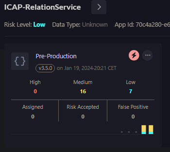
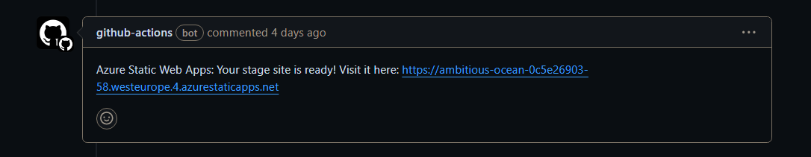
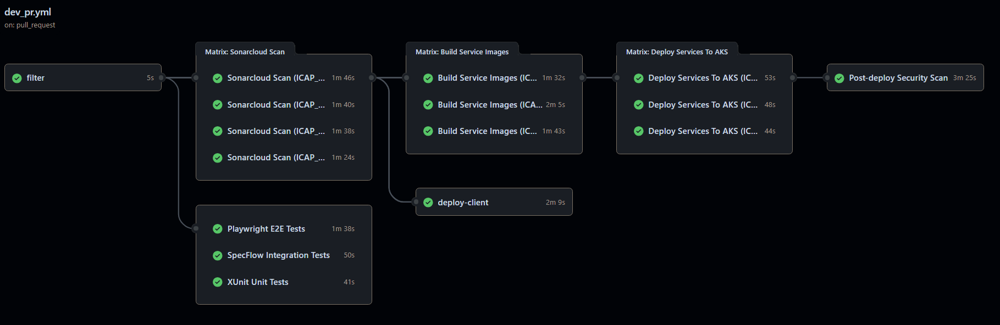
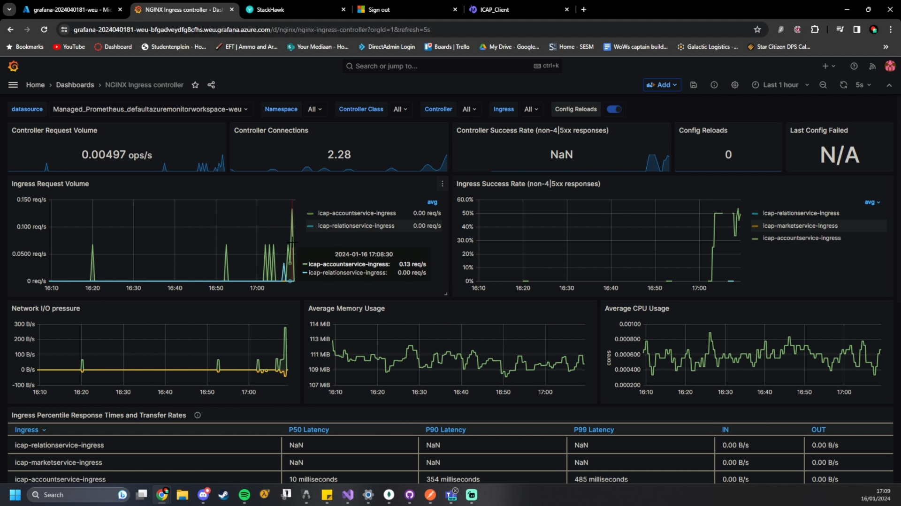

# DevOps Analysis
DevOps is not just about CI/CD, but the automation of software development and IT operations as a means for improving and shortening the development lifecycle. A full delivery pipeline consists out of building, testing, producing a release, monitoring the product through monitoring tools and then planning a new cycle accordingly. This document serves to provide evidence for the how the entire DevOps environment for ICAP is set up.

## Continuous Integration
Continuous delivery (CI for short) is a software development practice where developers regularly merge their code changes into a central repository, preferably several times a day. Each integration is then verified by an automated build and automated tests. This practice is primarily aimed at detecting and addressing conflicts and issues early in the development cycle.

Within ICAP, CI is implemented by using GitHub actions to both build and test the integration of new code. Whenever a new commit on the development branch is made, the automatic CI pipeline triggers to both build the code and statically analyse it. Sonarcloud is integrated into this part of the CI GitHub actions in order to verify code quality and the ability to build the project.

The GitHub Actions workflow file for pushes being done on the development branch looks like the following:

```yml
name: PUSH to DEV

on:
  push:
    branches: "development"
    paths:
      - "srcs/**"
      - ".github/workflows/**"
  workflow_dispatch:
  
jobs:
  filter:
    runs-on: ubuntu-latest
    outputs:
      ICAP_Client: ${{ steps.filter.outputs.ICAP_Client }}
      ICAP_AccountService: ${{ steps.filter.outputs.ICAP_AccountService }}
      ICAP_MarketService: ${{ steps.filter.outputs.ICAP_MarketService }}
      ICAP_RelationService: ${{ steps.filter.outputs.ICAP_RelationService }}
    steps:
    - uses: actions/checkout@v4
    - uses: dorny/paths-filter@v2
      id: filter
      with:
        filters: |
          ICAP_Client:
            - 'srcs/ICAP_Client/**'
          ICAP_AccountService:
            - 'srcs/ICAP_AccountService/**'
          ICAP_MarketService:
            - 'srcs/ICAP_MarketService/**'
          ICAP_RelationService:
            - 'srcs/ICAP_RelationService/**'
        base: 'development'      

  build-and-test:
    needs: filter
    runs-on: ubuntu-latest
    strategy:
      matrix:
        services: [ICAP_Client, ICAP_AccountService, ICAP_MarketService, ICAP_RelationService]
    steps:
    - uses: actions/checkout@v4
    - name: Setup .NET Core
      if: needs.filter.outputs[matrix.services] == 'true'
      uses: actions/setup-dotnet@v1
      with:
        dotnet-version: '8.0.x'
    - name: Build
      if: needs.filter.outputs[matrix.services] == 'true'
      run: |
        cd ./srcs/${{ matrix.services }}
        dotnet build $(ls *.csproj)

    - name: Unit Tests
      if: needs.filter.outputs[matrix.services] == 'true'
      run: |
        cd ./srcs/${{ matrix.services }}
        dotnet test --no-build $(ls *.csproj)

    - name: SonarCloud Scan
      if: needs.filter.outputs[matrix.services] == 'true'
      uses: highbyte/sonarscan-dotnet@v2.3.0
      with:
        sonarProjectKey: FHICT-Owen_ICAP
        sonarProjectName: ICAP
        sonarOrganization: fhict-s-owen
        dotnetBuildArguments: ./srcs/${{ matrix.services }}
        dotnetDisableTests: true
      env:
        SONAR_TOKEN: ${{ secrets.SONAR_TOKEN }}
        GITHUB_TOKEN: ${{ secrets.GITHUB_TOKEN }}
```

In this file I make use of a feature in GitHub Actions called a matrix. A GitHub Actions matrix allows the developer to add multiple elements to an array and pass that array to the worker. For each element in the array, the worker will create a new version of that job. The matrix in combination with the first filter action using `dorny/paths-filter@v2` allows me to dynamically test only the projects and/or directories that have changes compared to the last commit made.

I also make use of this matrix and path filter in my deployment workflow and pull request workflow. It allows me to deploy or test the relevant services that have changes in the development branch compared to the production branch. 

Lastly, when both the previously mentioned CI steps and the deployment process finish, I use the job below to run a StackHawk security scan against all endpoints of my application to see if there are any new vulnerabilities. 

```yml
stackhawk-hawkscan-services:
    name: Post-deploy Security Scan
    needs: [deploy-services]
    runs-on: ubuntu-latest
    steps:
    - uses: actions/checkout@v2
    - uses: stackhawk/hawkscan-action@v2.1.2
      with:
        apiKey: ${{ secrets.HAWK_API_KEY }}
        configurationFiles: ./stackhawk/stackhawk-accounts.yml, ./stackhawk/stackhawk-market.yml, ./stackhawk/stackhawk-relations.yml
```

Which ends up looking something like this on the StackHawk dashboard.



## Continuous Delivery
Continuous is the act of automatically preparing code changes for release to a production environment. In Continuous Delivery, every code change that passes the automated testing phase in the CI process is automatically built and tested in a staging or production-like environment. This ensures that the code is ready for deployment to production at any time.

Continuous Delivery is achieved within ICAP by having a GitHub Actions workflow that runs specifically when a new pull request is made from the development branch to main. All of the abovementioned CI steps and a few additional testing steps are run and need to be waited on for the pull request to be merged into development. A few more of the CI steps from the pull request specific workflow are shown below.

```yml
run-e2e-tests:
    name: Playwright E2E Tests
    needs: filter
    runs-on: ubuntu-latest
    steps:
    - uses: actions/checkout@v4
    - name: Setup .NET
      uses: actions/setup-dotnet@v3
      with:
        dotnet-version: '8.0.x'
    - name: Build Test Project
      run: |
        cd ./srcs/ICAP_Playwright.Tests
        dotnet build $(ls *.csproj) --configuration Debug
      env:
        Username: ${{ secrets.TESTACCOUNT_USERNAME }}
        Password: ${{ secrets.TESTACCOUNT_PASSWORD }}
    - name: Ensure browsers are installed
      run: pwsh ./srcs/ICAP_Playwright.Tests/bin/Debug/net8.0/playwright.ps1 install --with-deps
    - name: Run Tests
      run: |
        cd ./srcs/ICAP_Playwright.Tests
        dotnet test $(ls *.csproj)
      env:
        Username: ${{ secrets.TESTACCOUNT_USERNAME }}
        Password: ${{ secrets.TESTACCOUNT_PASSWORD }}

  run-integration-tests:
    name: SpecFlow Integration Tests
    needs: filter
    runs-on: ubuntu-latest
    steps:
    - uses: actions/checkout@v4
    - name: Setup .NET
      uses: actions/setup-dotnet@v3
      with:
        dotnet-version: '8.0.x'
    - name: Build Test Project
      run: |
        cd ./srcs/ICAP_AccountService.Specs
        dotnet build $(ls *.csproj) --configuration Debug
      env:
        MongoTestDatabaseName: "ICAP-Test"
        MongoTestConnectionString: ${{ secrets.MONGO_TEST_CONNECTION_STRING }}
        Username: ${{ secrets.TESTACCOUNT_USERNAME }}
        Password: ${{ secrets.TESTACCOUNT_PASSWORD }}
        ClientId: ${{ secrets.ENTRA_CLIENT_ID }}
        TenantId: ${{ secrets.ENTRA_TENANT_ID }}
        Scope: ${{ secrets.API_SCOPE_1 }}
        AzureServiceBus: ${{ secrets.AZ_SB }}
    - name: Run Tests
      run: |
        cd ./srcs/ICAP_AccountService.Specs
        dotnet test $(ls *.csproj) --configuration Debug
      env:
        MongoTestDatabaseName: "ICAP-Test"
        MongoTestConnectionString: ${{ secrets.MONGO_TEST_CONNECTION_STRING }}
        Username: ${{ secrets.TESTACCOUNT_USERNAME }}
        Password: ${{ secrets.TESTACCOUNT_PASSWORD }}
        ClientId: ${{ secrets.ENTRA_CLIENT_ID }}
        TenantId: ${{ secrets.ENTRA_TENANT_ID }}
        Scope: ${{ secrets.API_SCOPE_1 }}
        AzureServiceBus: ${{ secrets.AZ_SB }}

  run-unit-tests:
    name: XUnit Unit Tests
    needs: filter
    runs-on: ubuntu-latest
    steps:
    - uses: actions/checkout@v4
    - name: Setup .NET
      uses: actions/setup-dotnet@v3
      with:
        dotnet-version: '8.0.x'
    - name: Build Test Project
      run: |
        cd ./srcs/ICAP_MarketService.Tests
        dotnet build $(ls *.csproj)
    - name: Run Tests
      run: |
        cd ./srcs/ICAP_MarketService.Tests
        dotnet test $(ls *.csproj)
```

These steps run all of the relevant tests for the ICAP project and make it so the PR either fails or passes based on these jobs. In addition to these tests, all of the services or clients with changes will be deployed. The deployment for the client happens in such a way that the cloud service resource that runs the client web app is able to check whether the newly uploaded project comes from the development or production branch. Based on the branch, it loads the project into the production environment or a separate test environment for which it sends a new separate test URL back to the comments of the pull request like in the picture below.



The backend services can also be deployed into a completely different Kubernetes cluster that serves as the staging environment from the pull request workflow. This is currently not being done because of the costs in having to create a completely new hosted cluster that is a carbon copy of the current one. The deployment strategy that this all falls under is blue-green deployment.

## Continuous Deployment
When all of the tests and deployments for blue-green deployment pass, the merge-request can be closed and merged into the production branch. From the production branch, a workflow file that is very similar to the one for the pull requests is triggered. The workflow once again runs all of the relevant tests, static code analyses and building of projects, after which it will deploy the final results to the production environment. The results of a successfull full CI/CD run look like this in the GitHub Actions overview.



I also maintain versioning for my entire cluster by building images that use the GitHub SHA to generate a random token that is then coupled specifically to the images that are uploaded to my Azure Container registry. This can be seen in the job below.

```yml
build-images:
    name: Build Service Images
    needs: [filter, sonar-scan, run-unit-tests, run-integration-tests]
    permissions:
      contents: read
      id-token: write
    runs-on: ubuntu-latest
    strategy:
      matrix:
        services: [ICAP_AccountService, ICAP_MarketService, ICAP_RelationService]
    steps:
      - uses: actions/checkout@v4
        if: needs.filter.outputs[matrix.services] == 'true'
      - uses: azure/login@v1
        if: needs.filter.outputs[matrix.services] == 'true'
        name: Azure login
        with:
          creds: ${{ secrets.AZURE_CREDENTIALS }}
      - name: Create ENV for name container image
        run: |
          echo "CONVERTED_IMAGE=$(echo '${{ matrix.services }}' | tr '[:upper:]' '[:lower:]' | tr '_' '-')" >> $GITHUB_ENV
      - name: Build and push image to ACR
        if: needs.filter.outputs[matrix.services] == 'true'
        run: az acr build --image ${{ env.CONVERTED_IMAGE }}:${{ github.sha }} --registry icapacr -g ICAP -f ./srcs/Dockerfile.${{ matrix.services }} ./srcs/
```

After the images are successfully built, the manifest files are then applied to the AKS service and the image related tags are dynamically overwritten using the job that can be seen below. This makes sure that the new pods are started with the latest possible image of that service.

```yml
  deploy-services:
    name: Deploy Services To AKS
    needs: [filter, build-images]
    permissions:
      actions: read
      contents: read
      id-token: write
    runs-on: ubuntu-latest
    strategy:
      matrix:
        services: [ICAP_AccountService, ICAP_MarketService, ICAP_RelationService]
    steps:
      - uses: actions/checkout@v4
        if: needs.filter.outputs[matrix.services] == 'true'
      - uses: azure/login@v1
        if: needs.filter.outputs[matrix.services] == 'true'
        name: Azure login
        with:
          creds: ${{ secrets.AZURE_CREDENTIALS }}
      - uses: azure/use-kubelogin@v1
        if: needs.filter.outputs[matrix.services] == 'true'
        name: Set up kubelogin for non-interactive login
        with:
          kubelogin-version: v0.0.25
      - uses: azure/aks-set-context@v3
        if: needs.filter.outputs[matrix.services] == 'true'
        name: Get K8s context
        with:
          admin: "false"
          cluster-name: ICAP_AKS
          resource-group: ICAP
          use-kubelogin: "true"
      - name: Create ENV for name container image
        run: |
          echo "CONVERTED_IMAGE=$(echo '${{ matrix.services }}' | tr '[:upper:]' '[:lower:]' | tr '_' '-')" >> $GITHUB_ENV
      - uses: Azure/k8s-deploy@v4
        if: needs.filter.outputs[matrix.services] == 'true'
        name: Deploys application
        with:
          action: deploy
          images: icapacr.azurecr.io/${{ env.CONVERTED_IMAGE }}:${{ github.sha }}
          manifests: |
            ./srcs/${{ matrix.services }}/manifests/deployment.yaml
            ./srcs/${{ matrix.services }}/manifests/service.yaml
            ./srcs/${{ matrix.services }}/manifests/podautoscaler.yaml
            ./srcs/${{ matrix.services }}/manifests/ingress.yaml
            ./srcs/${{ matrix.services }}/manifests/secretprovider.yaml
          namespace: default
```
## Testing
Within the workflows of ICAP, I've specifically added unit, integration and E2E tests that are required for the rest of the pipeline. The exact contents of these tests are explained in my [testing report](./Testing_Report.md) document.

## Monitoring
After the CI/CD workflow finishes, the next step of the DevOps cycle sets in. This step is monitoring and logging the application. This is specifically done to ensure the reliability, performance, and security of the application. Within ICAP, monitoring and logging is implemented in the form of Prometheus for pulling all of the data from Kubernetes and its services and Grafana to then convert that data into interpretable graphs and statistics.



This is one of the examplary dashboards for the NGINX Ingress Controller. As all of the services within ICAP are not publicly exposed and all the traffic is being routed through the Ingress controller, the Ingress controller is a very good way to monitor any error responses that are being sent back to the clients. The response times for requests can also be monitored here.