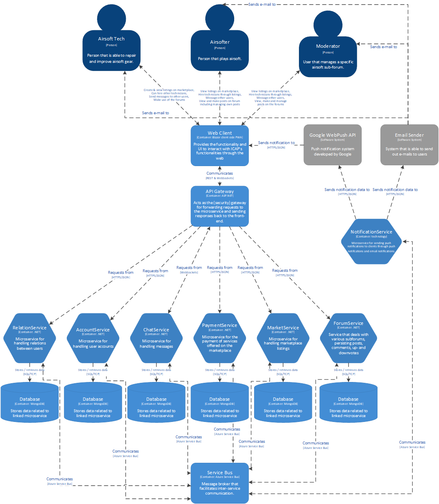
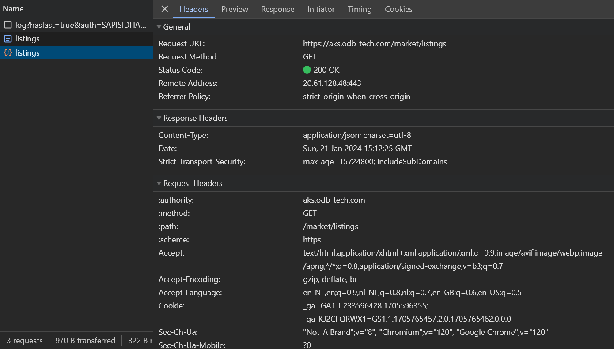

# Architecture Risk Analysis
This document serves to analyse the security vulnerabilities within ICAP. After a brief overview of the application, various security analyses will be applied in order to find out how ICAP should be made secure by design.

## Application Overview
Attached below is a container diagram of ICAP that serves as a quick overview of the different components that make up the project. ICAP is a marketing, forum and messenging platform in one. Its purpose is to serve as the international communications backbone for the airsoft community. In order to be able to scale reliably for the hundreds of thousands of possible users within the international airsoft community, a microservices architecture was chosen for the project.

The microservices architecture allows for improved scaling, fault isolation and service resilliency among a few other things. Because of the highly decoupled nature of microservices it also means that there are possibly more vulnerabilities in the system due to communication between services having to take place over the web instead of within the server. Furthermore, requests from the front-end also have to be routed through the individual microservices

## OWASP Top 10
The OWASP Top 10 Web Application Security Risks for 2021 highlights the most critical security risks to web applications. Here's a summary of each category:

1. **Broken Access Control**
   - Issues with applications failing to restrict access properly, allowing attackers to exploit permissions.

2. **Cryptographic Failures**
   - Focus on failures in cryptography, leading to data breaches. Previously known as Sensitive Data Exposure.

3. **Injection**
   - Various forms of injection attacks, like SQL injection, where malicious code is inserted into applications.

4. **Insecure Design**
   - A new category emphasizing the importance of secure design patterns and principles in application development.

5. **Security Misconfiguration**
   - Misconfigured permissions, unnecessary features, or verbose error messages exposing systems to attack.

6. **Vulnerable and Outdated Components**
   - Using components with known vulnerabilities, which can be a gateway for attacks.

7. **Identification and Authentication Failures**
   - Failures in correctly identifying and authenticating users, leading to unauthorized access.

8. **Software and Data Integrity Failures**
   - A new category addressing risks in software updates and data integrity, especially in CI/CD pipelines.

9. **Security Logging and Monitoring Failures**
   - Insufficient logging and monitoring, hindering breach detection and response.

10. **Server-Side Request Forgery (SSRF)**
   - Manipulating the server to send forged requests, potentially leading to unauthorized actions or data access.

All of the OWASP top 10 security risks are very important to take into account, but in order to make ICAP more secure the security risks above should be applied in a more practical way. In order to achieve that, it is important to create misuse cases that apply specifically to ICAP and figure out how to mitigate or solve those vulnerabilities alltogether. This will be addressed in the next section.

## Examplary Misuse Cases Based On OWASP
Below are some examplary misuse cases where a bad actor tries to gain access to the system. These examples are ordered in the same way as the top 10 in the section above. These cases serve as generic misuse cases that can then be applied to ICAP in order to get applicable misuse cases and solve possible security vulnerabilities.

1. An attacker exploits access control mechanisms to gain unauthorized access to data or functionality, modify data, or perform actions that should be restricted to the user type he has access to.
2. An attacker takes advantage of weak or improperly implemented cryptography to access sensitive data, such as intercepting data in transit or decrypting sensitive data stored insecurely.
3. An attacker sends malicious data to the system, leading to the execution of unintended commands or accessing unauthorized data, for example, SQL injection, command injection, or LDAP injection.
4. An attacker exploits design flaws in the application, potentially leading to widespread security issues, due to lack of proper threat modeling or secure design patterns.
5. An attacker takes advantage of insecure default configurations, incomplete setups, open cloud storage, misconfigured HTTP headers, or verbose error messages to gain unauthorized access or knowledge of the system.
6. An attacker targets known vulnerabilities in outdated or unpatched components (libraries, frameworks, software modules) to compromise the system or steal data.
7. An attacker exploits weaknesses in authentication and identification mechanisms to impersonate legitimate users, such as through credential stuffing, brute force attacks, or exploiting improperly implemented multi-factor authentication.
8. An attacker manipulates the integrity of software or data, for example, through unauthorized code changes, tampering with data, or Man-in-the-Middle attacks against software update mechanisms.
9. Due to inadequate logging and monitoring, an attacker’s malicious activities go undetected, allowing them to maintain persistence, escalate privileges, or perform additional attacks without being noticed.
10. An attacker manipulates the server to perform unintended requests to internal systems, potentially leading to information disclosure, internal system enumeration, or other malicious activities​​.

## Analysis Based On CIAP
CIAP is a metric used to classify data into a scale that is easy to understand. It consists of the following classifications:
- **Confidentiality**: public (0), company confidential (1), confidential (2), classified (3)
- **Integrity**: unprotected (0), protected (1), high (2), absolute (3)
- **Availability**: not needed (0), important (1), required (2), essential (3)
- **Privacy**: public (0), PII (p)

As ICAP has 3 different focusses combined into one platform, forums, messaging and a market system. A few data types that will have to exist within the application in order to make it a functioning application will be: Messages, Personal information, Market listings and Forum posts. Below these 4 data types will be classified using CIAP.

### Messages
In the context of ICAP's functionality, messages are between 2 or multiple individuals and are send using ICAP's instant messaging feature. The following classification can be given based on this information.
- **Confidentiality**: 1
- **Integrity**: 1
- **Availability**: 2
- **Privacy**: PII

### Personal information
When it comes to personal information, like address information, this data is subject to privacy laws and therefore should be kept confidential.
- **Confidentiality**: 2
- **Integrity**: 1
- **Availability**: 0
- **Privacy**: PII

### Market listings
Market listings are public listings that are viewable for anyone on the platform. They should only be editable by the technician that made the listing and nobody else. Listings should also be possible for guests to view.
- **Confidentiality**: 0
- **Integrity**: 1
- **Availability**: 2
- **Privacy**: 0

### Forum posts
A forum posts is pretty self-explanatory. Like the listing, they should only be editable by the original poster and be removable if deemed inappropriate by a moderator. These posts should also be viewable by anyone using the platform.
- **Confidentiality**: 0
- **Integrity**: 1
- **Availability**: 2
- **Privacy**: 0

## Misuse Cases
The following abuse cases were formulated based on some of the user stories within ICAP. 

### 1. Known Vulnerabilities
- *As an attacker, I find common open source or closed source packages with weaknesses and perform attacks against vulnerabilities and exploits which are disclosed.*

### 2. Broken Access Control
- *As an attacker, I bypass access control checks by modifying the URL, internal application state, or the HTML page, or simply using a custom API attack tool.*
- *As an attacker, I manipulate the primary key and change it to access another's users record, allowing viewing or editing someone else's account.*
- *As an attacker, I manipulate sessions, access tokens, or other access controls in the application to act as a user without being logged in, or acting as an admin/privileged user when logged in as a user.*
- *As an attacker, I force browsing to authenticated pages as an unauthenticated user or to privileged pages as a standard user.*
- *As an attacker, I access APIs with missing access controls for POST, PUT and DELETE.*

### 3. Messages
- *As an attacker, I eavesdrop on messages sent over unsecured or poorly encrypted connections.*
- *As an attacker, I spoof messages to appear as if they come from the messaging system itself.*
- *As an attacker, I flood the messaging system with a high volume of automated messages.*
- *As an attacker, I send messages with malicious attachments or links to unsuspecting users.*

### 4. Security Misconfiguration
- *As an attacker, I probe and exploit misconfigured firewall rules to access restricted network areas.*
- *As an attacker, I take advantage of debugging interfaces or verbose error messages left enabled in production.*
- *As an attacker, I intercept data transmitted over unencrypted connections due to lack of SSL/TLS implementation.*
- *As an attacker, I exploit incomplete or poorly configured authentication flows to gain unauthorized access.*
- *As an attacker, I exploit misconfigured keystores to access secrets that could give me elevated system access.*

## Mitigations
In the following section mitigations, for making sure the misuse cases from the previous section can not be applied, are shown. These mitigations are devided per the four categories from the misuse cases.

### 1. Known Vulnerabilities
#### Static code analysis
Making use of a platform like sonarqube/sonarcloud in order to do static code analysis to find out whether there are vulnerable parts of code being used that can be exploited is a big part of mitigating known vulnerabilities.

#### Dependabot alerts
GitHub has built-in functionality that makes sure that any known package vulnerabilities can be patched by updating the package versions. Doing so patches code vulnerabilities caused by dependencies.

### 2. Broken Access Control
#### Authentication & Authorization
The application should have a service or already well-established mechanism of authorizing users and requests to make sure that bad actors do not gain access to parts of the system that they should not have access to. This includes a way to secure all services by checking if requests that come in have the proper authority to access the endpoint in question. 

#### Principle of Least Privilege
Apply the principle of least privilege to microservice access controls. This minimizes each service's access to only what is necessary, reducing the potential impact of a compromised service.

#### Secure API gateway
An API Gateway acts as a control point to enforce access control, reducing the complexity within individual microservices and providing a unified authentication/authorization layer. This gateway can then also make it so there is only a single ingress point for the entire system.

### 3. Messages
#### Use of WSS
Make sure that when websockets are established for messaging, the WSS protocol is used so all messages are secured.

#### Message Bus
Using Azure Service bus as the main messaging bus means that requests are always encrypted using TLS. This makes sure that any messages that get intercepted are still unreadable.

### 4. Security Misconfiguration
#### Separate configs for production and staging
This is to make sure that no debug related logging features make it into production code that can then be used to gain more information about the system. 

#### Azure Key Vault
The use of Azure Key Vault makes sure that any secrets for the front- and back-end are stored securely and not easily accessible to end-users. 

## Non-functional requirements
The following non-functional requirements were formulated based off the premise of this risk analysis.
- ICAP must support role-based access control mechanisms to ensure that only authorized users can access specific functions based on their roles.
- All sensitive data, including user credentials and personal information, must be encrypted using advanced encryption standards (AES) with a minimum key length of 256 bits. This applies to both data at rest and in transit.
- ICAP should utilize a centralized and secure vault for managing secrets, such as API keys, database credentials, and configuration settings, with strict access control and auditing capabilities. This goes for both the repository and the production environment.
- Implement protections against cross-site scripting (XSS) and cross-site request forgery (CSRF) attacks to secure the application from common web vulnerabilities.
- ICAP must utilize strong, multi-factor authentication mechanisms to mitigate risks associated with identification and authentication failures. This includes implementing account lockout mechanisms after a certain number of failed attempts and ensuring secure password recovery processes.
- The application applies encryption to the communication of confidential information over non safe networks.

## Validation of security-related non-functional requirements
Due to time restrictions, only a few of the abovementioned non-functional requirements can be validated. These specifically covered non-functional requirements are mentioned below here in a section of their own.

### StackHawk 
StackHawk is a Dynamic Application Security Testing (DAST) tool that allows for the automation of testing applications in their running state to identify security vulnerabilities. StackHawk's DAST capabilities extend to a broad spectrum of vulnerabilities, including but not limited to:

- SQL Injection
- Cross-Site Scripting (XSS) 
- Cross-Site Request Forgery (CSRF)
- And a wide range of other vulnerabilities typically found in the OWASP Top 10 list

Thus makint it possible to cover and mitigate a lot of the risks specifically mentioned in the OWASP Top 10 by actively scanning for these risks using StackHawk.

### Applying encryption over non-safe networks
In order to mitigate the risk involved with this requirement, an SSL certificate should be acquired so HTTPS is used across the entire project. In order to make sure HTTP is not still being used, any and all requests should also be automatically forwarded to HTTPS. For the AKS cluster this can be achieved by annotating the ingress resources with the `nginx.ingress.kubernetes.io/ssl-redirect: "true"` annotation. This then causes all traffic to be routed using HTTPS. Sending a request using http like doing a GET request to `http://aks.odb-tech.com/market/listings` results in an automatic redirect with HTTP status code 307 like below.

Which in turn results into a request using HTTPS.

### Role-based access control

