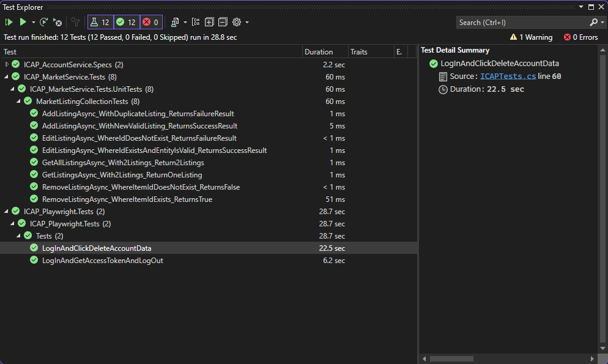

# Testing Report
ICAP has a lot of different technologies and functions incorporated into it. All these functions and technologies should also be tested using a form of testing to validate that the application behaves as expected. In this document, the various testing methods and strategies for ICAP are laid out with evidence that serves to validate that the behaviour of ICAP is as expected.

## Unit Tests
When it comes to unit testing, I've written a few unit tests where some have an expected failure case and and some a success case. These unit tests were written for the MarketListingCollection in ICAP_MarketService. All of the required methods from the collection require an implementation of `IRepository<MarketListing>` to read and write data from the database. I've mocked the IRepository implementation through Moq. This is done so I don't actually have to connect with the database but can still validate that my business logic functions as expected. The implementation of this mock repository can be seen below.

```csharp
public MarketListingCollectionTests()
{
    var mockDatabase = new Mock<IMongoDatabase>();
    var mockRepository = new Mock<MongoRepository<MarketListing>>(mockDatabase.Object, "");

    var sampleList = new List<MarketListing>
    {
        new()
        {
            Id = "0",
            Title = "Test1",
            Category = ServiceCategory.FullReplicaBuild,
            Description = "This is the description of a full test entity",
            CreatedDateTime = DateTimeOffset.Now,
            ImageLink = "https://test.com/image",
            Price = 10.99,
            UserId = "1"
        },
        new()
        {
            Id = "1",
            Title = "Test2",
            Category = ServiceCategory.FullReplicaBuild,
            Description = "This is the description of a full test entity",
            CreatedDateTime = DateTimeOffset.Now,
            ImageLink = "https://test.com/image",
            Price = 12.99,
            UserId = "1"
        }
    };

    mockRepository.Setup(func => func.GetAllAsync()).ReturnsAsync(sampleList);
    mockRepository.Setup(func => func.GetAllAsync(It.IsAny<Expression<Func<MarketListing, bool>>>()))
        .ReturnsAsync((Expression<Func<MarketListing, bool>> filter) =>
        {
            var filteredList = sampleList.Where(filter.Compile()).ToList();
            return filteredList;
        });
    mockRepository.Setup(func => func.GetAsync(It.IsAny<string>()))
        .ReturnsAsync((string filter) =>
        {
            var item = sampleList.FirstOrDefault(item => item.Id == filter);
            return item;
        });
    mockRepository.Setup(func => func.GetAsync(It.IsAny<Expression<Func<MarketListing, bool>>>()))
        .ReturnsAsync((Expression<Func<MarketListing, bool>> filter) =>
        {
            var item = sampleList.FirstOrDefault(filter.Compile());
            return item;
        });
    mockRepository.Setup(func => func.CreateAsync(It.IsAny<MarketListing>()));
    mockRepository.Setup(func => func.UpdateAsync(It.IsAny<MarketListing>()));
    mockRepository.Setup(func => func.RemoveAsync(It.IsAny<string>()));
    mockRepository.Setup(func => func.RemoveAsync(It.IsAny<Expression<Func<MarketListing, bool>>>()));

    _mockRepository = mockRepository.Object;
}
```

The results of the tests that I made with descriptive names can be seen in the screenshot below here. As you can see, there is one test that is not executed. This is because that test is not actually a Unit test, but a SpecFlow based Integration test. We will get to the SpecFlow based integration tests in the next section.



## Integration Tests
For integration testing I created 2 integration tests that using SpecFlow for my ICAP_AccountService. The Integration test creates an in-memory version of the Web API and connects to the MongoDB test database I have configured. I do this through a combination of setting up hooks and step definitions. The step definition setup looks like this:

```csharp
var projectRootPath = Directory.GetCurrentDirectory();
while (projectRootPath != null && !Directory.EnumerateFiles(projectRootPath, "*.csproj", SearchOption.TopDirectoryOnly).Any())
{
    projectRootPath = Directory.GetParent(projectRootPath)?.FullName;
}

var json = File.ReadAllText(Path.Combine(projectRootPath, AccountServiceHooks.AppSettingsFile));
var configuration = JObject.Parse(json);
var clientId = configuration["ClientId"]?.ToString() ?? throw new ArgumentNullException();
var tenantId = configuration["TenantId"]?.ToString() ?? throw new ArgumentNullException();
var username = configuration["Username"]?.ToString() ?? throw new ArgumentNullException();
var password = configuration["Password"]?.ToString() ?? throw new ArgumentNullException();
var scopes = configuration["Scopes"]?.ToObject<string[]>();

var app = PublicClientApplicationBuilder.Create(clientId)
    .WithAuthority($"https://login.microsoftonline.com/{tenantId}")
    .Build();

var result = app.AcquireTokenByUsernamePassword(scopes, username, password)
    .ExecuteAsync().Result;
_token = result.AccessToken;
_factory = factory;
_repository = repository;
```
Combining this with the hooks that looks like the codeblock below sets up all the necessary information for the tests.

```csharp
public class AccountServiceHooks(IObjectContainer objectContainer)
{
    public const string AppSettingsFile = "appsettings.json";

    [BeforeScenario]
    public async Task RegisterServices()
    {
        var factory = GetWebApplicationFactory();
        await ClearData(factory);
        objectContainer.RegisterInstanceAs(factory);
        var repository = (IRepository<User>)factory.Services.GetService(typeof(IRepository<User>))!;
        objectContainer.RegisterInstanceAs(repository);
    }

    private WebApplicationFactory<Program> GetWebApplicationFactory() =>
        new WebApplicationFactory<Program>()
            .WithWebHostBuilder(builder =>
            {
                builder.ConfigureAppConfiguration((_, config) =>
                {
                    config.AddUserSecrets<Program>();
                    config.AddJsonFile(Path.Combine(Directory.GetCurrentDirectory(), AppSettingsFile));
                });
                builder.ConfigureTestServices(services =>
                {
                    services.AddMongo()
                        .AddMongoRepository<User>("users");
                });
            });

    private async Task ClearData(
        WebApplicationFactory<Program> factory)
    {
        if (factory.Services.GetService(typeof(IRepository<User>))
            is not IRepository<User> repository) return;
        var entities = await repository.GetAllAsync();
        foreach (var entity in entities)
            await repository.RemoveAsync(entity.Id);
    }
}
```

The Gherkin tests themself look as follows:

```gherkin
Feature: Account Service Web API

Scenario: Get Accounts
	Given I am a client
	And the repository has user data
	When I make a GET request to '/users'
	Then the response status code should be '200'
	And the response json should be a list of user objects

Scenario: Add Account
	Given I am a client
	When I make a POST request to '/users'
	Then the response status code should be '201'
	And the response json should be the created user object
```
And the results of the tests look like this in the Test UI from Visual Studio:


The Add Account feature in particular I am very proud of because it is an endpoint that requires an access token in order to be able to add a new account. I do this programmatically through the MSAL Library provided by Microsoft.

## End-to-End Tests (E2E)
For E2E tests I chose to go with the .NET version of PlayWright that integrates directly with NUnit. PlayWright allows users to easily write and generate E2E tests with their codegen tool or the provided documentation. Using PlayWright, I wrote 2 tests, one for acquiring an access token after logging in and then back out, and the other one for logging in and then deleting the user's data. The tests were written as follows:

```csharp
private string _email;
private string _password;

[SetUp]
public async Task SetupTests()
{
    var projectRootPath = Directory.GetCurrentDirectory();
    while (projectRootPath != null && !Directory.EnumerateFiles(projectRootPath, "*.csproj", SearchOption.TopDirectoryOnly).Any())
    {
        projectRootPath = Directory.GetParent(projectRootPath)?.FullName;
    }

    var json = File.ReadAllText(Path.Combine(projectRootPath, "appsettings.json"));
    var configuration = JObject.Parse(json);
    _email = configuration["Username"]?.ToString() ?? throw new ArgumentNullException();
    _password = configuration["Password"]?.ToString() ?? throw new ArgumentNullException();
    await Page.GotoAsync("https://icap.odb-tech.com/");
    await Page.WaitForSelectorAsync("header");
}

[Test]
public async Task LogInAndGetAccessTokenAndLogOut()
{
    await Expect(Page.GetByRole(AriaRole.Banner)).ToContainTextAsync("Log In");
    var page1 = await Page.RunAndWaitForPopupAsync(async () =>
    {
        await Page.GetByRole(AriaRole.Button, new() { Name = "Log In" }).ClickAsync();
    });
    await page1.GetByPlaceholder("Email, phone, or Skype").FillAsync(_email);
    await page1.GetByPlaceholder("Email, phone, or Skype").ClickAsync();
    await page1.GetByRole(AriaRole.Button, new() { Name = "Next" }).ClickAsync();
    await page1.GetByPlaceholder("Password").FillAsync(_password);
    await page1.GetByRole(AriaRole.Button, new() { Name = "Sign in" }).ClickAsync();
    var buttonLocator = Page.Locator("button:text('Ask later')");
    if (await buttonLocator.IsVisibleAsync()) await page1.GetByRole(AriaRole.Button, new() { Name = "Ask later" }).ClickAsync();
    await page1.RunAndWaitForRequestFinishedAsync(async () =>
    {
        await page1.GetByRole(AriaRole.Button, new() { Name = "No" }).ClickAsync();
    });
    await Expect(Page.GetByRole(AriaRole.Banner)).ToContainTextAsync("Log Out");
    await Page.GotoAsync("https://icap.odb-tech.com/user");
    var elementLocator = Page.Locator("#access-token");
    await elementLocator.WaitForAsync();
	var token = await elementLocator.TextContentAsync();
    await Page.GetByRole(AriaRole.Button, new() { Name = "Log Out" }).ClickAsync();
    await Page.Locator("[data-test-id=\"testaccount\\@owendebreetjes\\.onmicrosoft\\.com\"]").ClickAsync();
    await Page.GotoAsync("https://icap.odb-tech.com/");
    await Expect(Page.GetByRole(AriaRole.Banner)).ToContainTextAsync("Log In");
    Console.WriteLine("Access Token: " + token);
}

[Test]
public async Task LogInAndClickDeleteAccountData()
{
    await Expect(Page.GetByRole(AriaRole.Banner)).ToContainTextAsync("Log In");
    var page1 = await Page.RunAndWaitForPopupAsync(async () =>
    {
        await Page.GetByRole(AriaRole.Button, new() { Name = "Log In" }).ClickAsync();
    });
    await page1.GetByPlaceholder("Email, phone, or Skype").FillAsync(_email);
    await page1.GetByPlaceholder("Email, phone, or Skype").ClickAsync();
    await page1.GetByRole(AriaRole.Button, new() { Name = "Next" }).ClickAsync();
    await page1.GetByPlaceholder("Password").FillAsync(_password);
    await page1.GetByRole(AriaRole.Button, new() { Name = "Sign in" }).ClickAsync();
    var buttonLocator = Page.Locator("button:text('Ask later')");
    if (await buttonLocator.IsVisibleAsync()) await page1.GetByRole(AriaRole.Button, new() { Name = "Ask later" }).ClickAsync();
    await page1.RunAndWaitForRequestFinishedAsync(async () =>
    {
        await page1.GetByRole(AriaRole.Button, new() { Name = "No" }).ClickAsync();
    });
    await Expect(Page.GetByRole(AriaRole.Banner)).ToContainTextAsync("Log Out");
    await Page.GotoAsync("https://icap.odb-tech.com/user");
    await Page.RunAndWaitForRequestFinishedAsync(async () =>
    {
        await Page.GetByRole(AriaRole.Button, new() { Name = "Delete" }).ClickAsync();
    });
    await Page.Locator("[data-test-id=\"testaccount\\@owendebreetjes\\.onmicrosoft\\.com\"]").ClickAsync();
    await Page.GotoAsync("https://icap.odb-tech.com/");
    await Expect(Page.GetByRole(AriaRole.Banner)).ToContainTextAsync("Log In");
}
```

The results from the test setup shown above are shown below, including the Access token that is printed out during the test for acquiring the access token. 


## Load Testing
I used load testing within the project to validate if my Learning Outcome for scalable architectures is achievable. The specific non-functional requirement that should be validated using load testing is the one below:

```
The platform must be capable of supporting a minimum of 100,000 concurrent users engaged in activities without degradation of performance.
```

I decided to create a load test using Azure Load Testing that hits a get endpoint on each of my services. This test consists of the following requests:
- GET: https://aks.odb-tech.com/accounts/users
- GET: https://aks.odb-tech.com/market/listings
- GET: https://aks.odb-tech.com/relations/friendrequests

The test is set up to run on with 250 users per engine and a total of 4 engines at once, which gives us 1000 users. The stress test duration is 10 minutes with 1 minute of ramp up time. I made this test to verify that the Horizontal Pod Autoscaler (HPA) will scale up pods when pods hit more than 10 requests per second per pod. Below is a video of how the pods scale up very agressively with the current Autoscaler and deployment settings. 

Something to keep in mind is that the current node pool only has 5 nodes and each of those nodes has a VM attached with only 7GB of RAM and 2 CPU cores and thus 4 threads. The default HPA pod replicas are set to 2 per instance.


Looking at the request results, there is an average throughput 1207.28 requests/s, with an average response time of 220ms in the 90th percentile. What is remarkable is that the requests going to the endpoint of the request service are remarkably high at 1.17 seconds, but this is due to the cluster having to scale up pods as the request time thereafter drops to about 220ms per request.

The Error rate for the services is very very low for the 720k+ requests that were made, except for the account service. It is remarkably high at 13k errors. This errors are only HTTP status 500 errors, telling me that there is a bug in the code of the account service that is causing this high error rate. The other errors in the test are of type `org.apache.http.NoHttpResponseException`, which means there was a brief time where JMeter was unable get a response from the services. 


Only right at the start, when pods need to be scaled up, does the kubernetes engine CPU usage spike shortly. It stabilizes at an average of 15% CPU usage to run Kubernetes, this means that the Engine can handle quite a few more pods. 

If we extrapolate the data linearly then with the current Engine and service health and throughput it can be assumed that the application will only handle a maximum throughput of 8000 requests per second with 4 engine cpu instances. This would mean, that for handling 100.000 requests per second a total of 50 engine CPU instances are needed.

As for the amount of pods needed to handle 100.000 requests per second we need to consider that when using `kubectl get hpa` during the test, the current HPA configuration was reporting ~250% CPU usage, where the target was 40%. Every pod instance is configured to use 0.5 CPU thread at max and the 5 virtual machines were reporting ~90% cpu usage on average. 


Considering this, the amount of CPUs needed to host all of the pods at 100.000 requests per second would be ~1.000 CPU cores. There were a total of 45 service specific pods that were handling the requests, which would mean 4.500 pods are needed to scale to 100.000 requests per second.